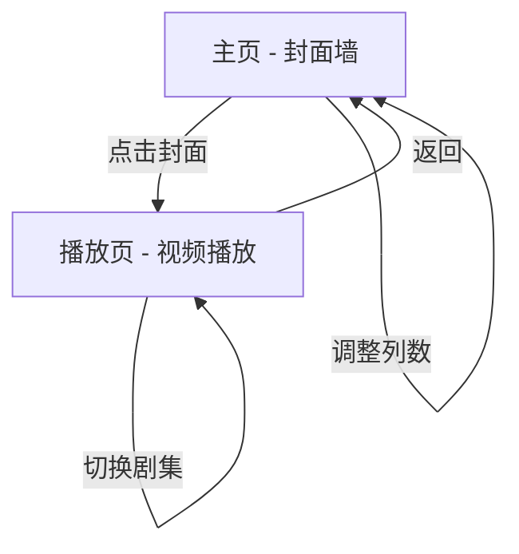

## 1. 产品概述

基于 FastAPI + Vue 3 的本地番剧管理与观看网站，递归扫描用户自定义视频路径，以叶子文件夹名匹配番剧，提供科技黑漆风封面墙浏览与视频流播放体验。

- 解决本地番剧分散管理、难以浏览和快速播放的痛点，面向个人用户。
- 目标：打造一个高颜值、零配置数据库依赖的轻量本地番剧媒体库。

## 2. 核心功能

### 2.1 用户角色

本产品为纯本地个人使用，无需注册登录，不区分用户角色。

### 2.2 功能模块

本产品需求包含以下页面：

1. **主页**：封面墙展示、列数调节、搜索过滤、弥散动态背景。
2. **播放页**：视频流播放、剧集列表切换、播放进度记忆。

### 2.3 页面详情

| 页面名称 | 模块名称 | 功能描述 |
|---------|---------|---------|
| 主页 | 弥散动态背景 | 全屏深色渐变背景，带有缓慢流动的弥散光斑动画，营造科技黑漆氛围 |
| 主页 | 封面墙网格 | 以 CSS Grid 展示番剧封面卡片，支持用户自定义列数（2~8列），列数越多卡片间距越小（动态 Gap） |
| 主页 | 悬浮玻璃封面卡片 | 每张封面卡片具有毛玻璃背景、微弱阴影与悬浮效果；鼠标悬停时触发流光边框动画；点击进入播放页 |
| 主页 | 脉冲呼吸灯加载态 | 封面图加载中显示灰色方块占位，带有脉冲呼吸灯（亮度缓慢明灭）动画效果 |
| 主页 | 缺失封面占位 | 未匹配到封面时显示带"缺失封面"提示的默认占位图 |
| 主页 | 列数调节控件 | 提供 Slider 或数字输入控件，实时调整封面墙列数，状态持久化至 localStorage |
| 主页 | 搜索过滤 | 顶部搜索框，前端对番剧列表做实时关键词过滤 |
| 播放页 | 视频流播放器 | 基于 HTML5 Video 的播放器，支持通过 Range Header 进行视频流分段加载与拖动进度条 |
| 播放页 | 剧集列表侧栏 | 展示当前番剧下所有视频文件列表，点击切换播放 |
| 播放页 | 播放进度记忆 | 暂停或离开时将 currentTime 存入后端，下次打开自动定位到上次播放位置 |
| 播放页 | 返回导航 | 提供返回主页的导航按钮 |

## 3. 核心流程

### 用户操作流程

1. 用户在 `settings.json` 中配置视频路径，启动后端服务。
2. 后端递归扫描视频路径，识别叶子文件夹作为番剧单元，匹配 `data/covers/` 下的同名封面。
3. 用户打开主页，看到科技黑漆风封面墙，封面卡片以悬浮玻璃效果展示。
4. 用户可通过列数调节控件调整封面墙布局，通过搜索框过滤番剧。
5. 用户点击某张封面卡片，进入播放页。
6. 播放页加载对应番剧的剧集列表，默认播放第一集或上次观看进度处。
7. 用户可在剧集列表中切换集数，视频通过 Range Header 流式加载播放。
8. 用户暂停或离开时，播放进度自动保存。

## 4. 用户界面设计

### 4.1 设计风格

- **主色调**：深黑 `#0a0a0f`，辅以暗紫 `#1a1a2e` 与深蓝 `#16213e` 渐变
- **强调色**：霓虹青 `#00f0ff`，用于流光边框与交互高亮
- **按钮风格**：圆角微透明玻璃按钮，hover 时边框泛霓虹青流光
- **字体**：系统无衬线字体（`Inter, "Noto Sans SC", sans-serif`），标题 18px 加粗，正文 14px 常规
- **布局风格**：全屏沉浸式，顶部半透明导航栏，内容区 CSS Grid 封面墙
- **图标风格**：线性图标（Lucide Icons），霓虹青色

### 4.2 页面设计概览

| 页面名称 | 模块名称 | UI 元素 |
|---------|---------|---------|
| 主页 | 弥散动态背景 | 全屏 `#0a0a0f` 底色，2~3 个大尺寸模糊光斑（`#1a1a2e` / `#16213e`）以 CSS animation 缓慢漂移 |
| 主页 | 封面墙网格 | CSS Grid，`grid-template-columns: repeat(var(--cols), 1fr)`，gap 由 `calc(24px - (cols - 2) * 3px)` 动态计算 |
| 主页 | 悬浮玻璃封面卡片 | `backdrop-filter: blur(12px)`，`background: rgba(255,255,255,0.05)`，`border: 1px solid rgba(255,255,255,0.08)`，`box-shadow: 0 8px 32px rgba(0,0,0,0.4)`，hover 时 `border-color` 渐变流光动画（`conic-gradient` 旋转） |
| 主页 | 脉冲呼吸灯加载态 | 灰色方块 `#1a1a2e`，`animation: pulse 2s ease-in-out infinite`，亮度在 0.3~0.7 间缓动 |
| 主页 | 列数调节控件 | 顶部导航栏右侧 Slider，范围 2~8，当前值实时显示 |
| 主页 | 搜索框 | 顶部导航栏左侧，毛玻璃背景输入框，`placeholder: "搜索番剧..."` |
| 播放页 | 视频播放器 | 居中大尺寸 `<video>` 元素，深色背景，自定义控制栏 |
| 播放页 | 剧集列表侧栏 | 右侧固定侧栏，毛玻璃背景，列表项 hover 高亮，当前播放项霓虹青左边框 |
| 播放页 | 返回按钮 | 左上角箭头图标按钮，毛玻璃圆形，hover 流光 |

### 4.3 响应式设计

- **桌面优先**：主要面向桌面浏览器使用，封面墙默认 5 列。
- **移动端自适应**：小屏幕（<768px）自动切换为 2 列，播放页剧集列表折叠为底部抽屉。
- **触控优化**：封面卡片点击区域足够大（最小 44px），播放器支持触控手势控制进度。
