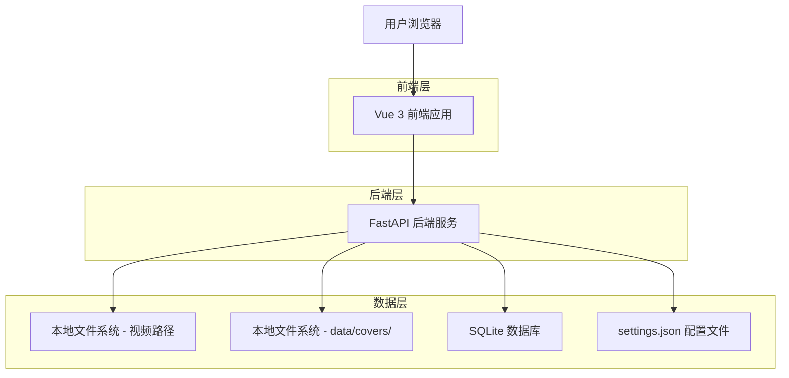
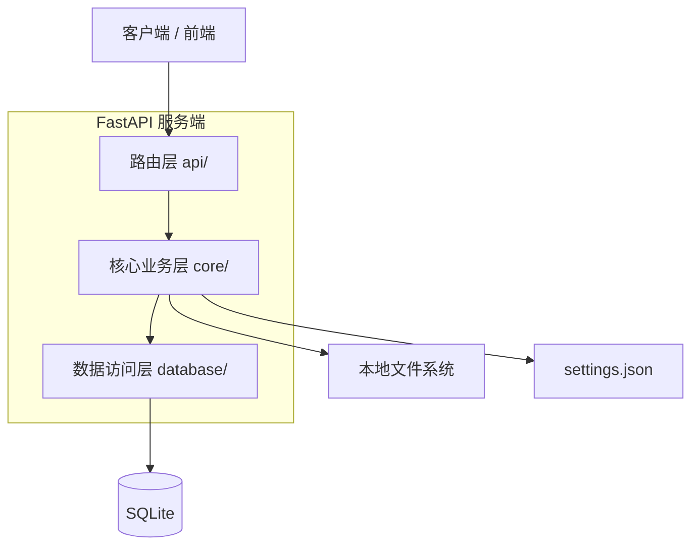
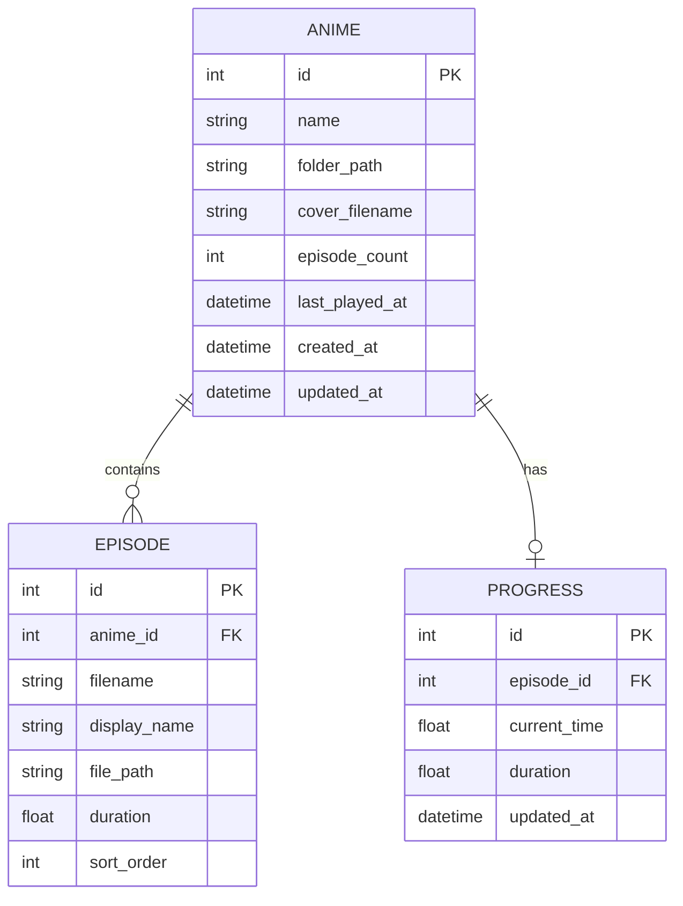

## 1. 架构设计



## 2. 技术说明

- 前端：Vue@3 + Vite + Tailwind CSS@3
- 后端：FastAPI + Uvicorn
- 数据库：SQLite（通过 SQLAlchemy ORM）

## 3. 路由定义

| 路由 | 用途 |
|------|------|
| `/` | 主页，展示科技黑漆风封面墙 |
| `/player/:animeName` | 播放页，视频流播放与剧集列表 |

## 4. API 定义

### 4.1 番剧列表

```
GET /api/anime/list
```

Response:
| 参数名 | 参数类型 | 描述 |
|--------|---------|------|
| id | integer | 番剧唯一 ID |
| name | string | 番剧名称（叶子文件夹名） |
| cover_url | string \| null | 封面图 URL，无匹配时为 null |
| episode_count | integer | 剧集总数 |
| last_played_at | string \| null | 上次播放时间 ISO 格式 |

### 4.2 番剧详情（含剧集列表）

```
GET /api/anime/{anime_id}/episodes
```

Response:
| 参数名 | 参数类型 | 描述 |
|--------|---------|------|
| anime_id | integer | 番剧 ID |
| name | string | 番剧名称 |
| episodes | array | 剧集列表 |

Episode 对象：
| 参数名 | 参数类型 | 描述 |
|--------|---------|------|
| id | integer | 剧集 ID |
| filename | string | 视频文件名 |
| display_name | string | 显示名称（去除扩展名） |
| duration | float \| null | 视频时长（秒） |

### 4.3 视频流分发

```
GET /api/stream/{episode_id}
```

Request Headers:
| 参数名 | 参数类型 | 是否必须 | 描述 |
|--------|---------|---------|------|
| Range | string | false | HTTP Range Header，如 `bytes=0-1048575` |

Response Headers:
| 参数名 | 参数类型 | 描述 |
|--------|---------|------|
| Content-Range | string | 返回范围，如 `bytes 0-1048575/104857600` |
| Content-Length | integer | 本次返回的字节数 |
| Accept-Ranges | string | 固定值 `bytes` |

### 4.4 播放进度

```
POST /api/anime/progress
```

Request:
| 参数名 | 参数类型 | 是否必须 | 描述 |
|--------|---------|---------|------|
| episode_id | integer | true | 剧集 ID |
| current_time | float | true | 当前播放秒数 |
| duration | float | true | 视频总时长 |

```
GET /api/anime/progress/{episode_id}
```

Response:
| 参数名 | 参数类型 | 描述 |
|--------|---------|------|
| current_time | float | 上次播放位置（秒） |

### 4.5 用户配置

```
GET /api/config
```

Response:
| 参数名 | 参数类型 | 描述 |
|--------|---------|------|
| video_paths | array\<string\> | 视频扫描路径列表 |
| exclude_keywords | array\<string\> | 排除关键词列表 |

```
PUT /api/config
```

Request:
| 参数名 | 参数类型 | 是否必须 | 描述 |
|--------|---------|---------|------|
| video_paths | array\<string\> | false | 更新视频扫描路径 |
| exclude_keywords | array\<string\> | false | 更新排除关键词 |

### 4.6 封面图静态服务

```
GET /api/covers/{filename}
```

直接返回 `data/covers/` 目录下的封面图片文件。

### 4.7 扫描触发

```
POST /api/anime/scan
```

手动触发重新扫描视频路径，刷新番剧列表数据库。

Response:
| 参数名 | 参数类型 | 描述 |
|--------|---------|------|
| scanned_count | integer | 本次扫描到的番剧数量 |

## 5. 服务端架构图



## 6. 数据模型

### 6.1 数据模型定义



### 6.2 数据定义语言

番剧表 (anime)
```sql
CREATE TABLE anime (
    id INTEGER PRIMARY KEY AUTOINCREMENT,
    name VARCHAR(255) NOT NULL,
    folder_path VARCHAR(512) NOT NULL UNIQUE,
    cover_filename VARCHAR(255),
    episode_count INTEGER DEFAULT 0,
    last_played_at TIMESTAMP,
    created_at TIMESTAMP DEFAULT CURRENT_TIMESTAMP,
    updated_at TIMESTAMP DEFAULT CURRENT_TIMESTAMP
);

CREATE INDEX idx_anime_name ON anime(name);
```

剧集表 (episodes)
```sql
CREATE TABLE episodes (
    id INTEGER PRIMARY KEY AUTOINCREMENT,
    anime_id INTEGER NOT NULL,
    filename VARCHAR(255) NOT NULL,
    display_name VARCHAR(255) NOT NULL,
    file_path VARCHAR(512) NOT NULL UNIQUE,
    duration REAL,
    sort_order INTEGER DEFAULT 0,
    created_at TIMESTAMP DEFAULT CURRENT_TIMESTAMP
);

CREATE INDEX idx_episodes_anime_id ON episodes(anime_id);
```

播放进度表 (progress)
```sql
CREATE TABLE progress (
    id INTEGER PRIMARY KEY AUTOINCREMENT,
    episode_id INTEGER NOT NULL UNIQUE,
    current_time REAL DEFAULT 0,
    duration REAL DEFAULT 0,
    updated_at TIMESTAMP DEFAULT CURRENT_TIMESTAMP
);

CREATE INDEX idx_progress_episode_id ON progress(episode_id);
```

初始化数据
```sql
-- settings.json 为纯文件配置，无需入库
-- 首次启动时由 scanner.py 扫描填充 anime 与 episodes